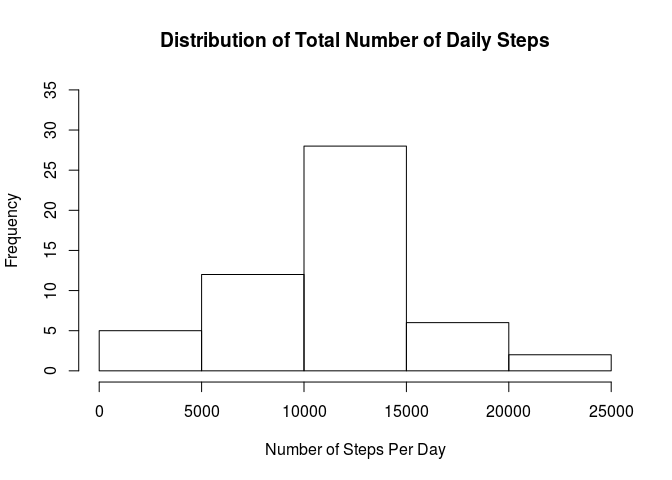
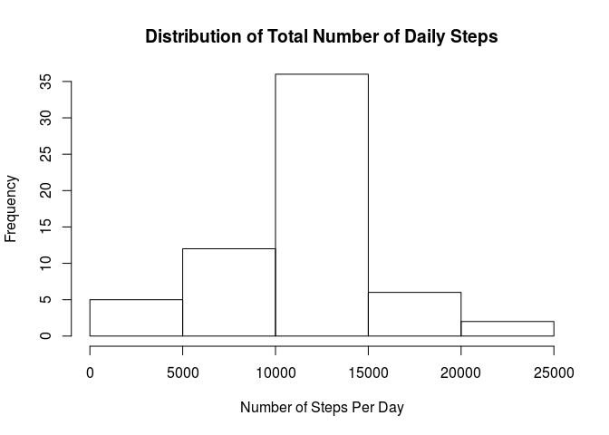
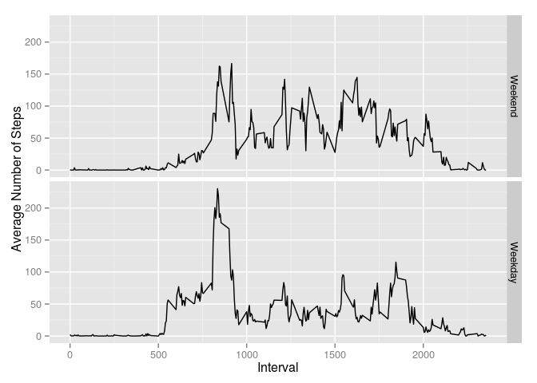

# PA1_template
Joel Smith  
05/16/2015  
# Project 1

This document describes the steps I took to complete this assignment which "makes use of data from a personal activity monitoring device." "The data consists of two months of data from an anonymous individual collected during the months of October and November, 2012 and include the number of steps taken in 5 minute intervals each day."

# Data

The description of the data is directly quoted from the assignment: 

The data for this assignment can be downloaded from the course web site:

 - Dataset: Activity monitoring data 
 
The variables included in this dataset are:

 - steps: Number of steps taking in a 5-minute interval (missing values are coded as NA)
 - date: The date on which the measurement was taken in YYYY-MM-DD format
 - interval: Identifier for the 5-minute interval in which measurement was taken

The dataset is stored in a comma-separated-value (CSV) file and there are a total of 17,568 observations in this dataset.

# Assignment

## Loading and Preprocessing data

In this section I 

 - download the data from https://d396qusza40orc.cloudfront.net/repdata%2Fdata%2Factivity.zip, 
 - unzip the contents using the unz command
 - read it into a data frame, activity
 - create date3 variable
 - and for a later section create the factor variable weekend
 

```r
url <- "https://d396qusza40orc.cloudfront.net/repdata%2Fdata%2Factivity.zip"
download.file(url, method="curl", destfile="activity.zip")
activity <- read.csv(unz("activity.zip", filename="activity.csv"))
activity$date2 <- as.character(activity$date)
activity$date3 <- as.Date(activity$date2, "%Y-%m-%d")
activity$weekend <- factor(x=weekdays(activity$date3) %in% c("Saturday", "Sunday"), levels=c(TRUE, FALSE), labels=c("Weekend", "Weekday"))
```

## What is mean total number of steps taken per day?

In this section I will "ignore missing values in the dataset." I will do this using the suggestion from http://r.789695.n4.nabble.com/aggregate-function-na-action-td3261043.html which explains: 
The subtle distinction between na.action=na.omit and na.rm=TRUE with the function you're calling is that na.omit will remove the entire row of data when it encounters a missing value, while the na.rm=TRUE argument will remove missing values separately from each variable... This distinction can be exploited using the formula aggregate when invoking na.action=na.omit. This removes observations with missing values. 

Removing missing observations is important. Without it aggregate would create observations for dates that have no non-missing information. 

### Calculate the total number of steps taken per day

Use aggregate with the formula to remove observations with missing values.


```r
tot.na <- aggregate(.~date3, activity[, c("date3", "steps")], FUN=sum, na.action=na.omit)
names(tot.na) <- c("date", "steps")
tot.na
```

```
##          date steps
## 1  2012-10-02   126
## 2  2012-10-03 11352
## 3  2012-10-04 12116
## 4  2012-10-05 13294
## 5  2012-10-06 15420
## 6  2012-10-07 11015
## 7  2012-10-09 12811
## 8  2012-10-10  9900
## 9  2012-10-11 10304
## 10 2012-10-12 17382
## 11 2012-10-13 12426
## 12 2012-10-14 15098
## 13 2012-10-15 10139
## 14 2012-10-16 15084
## 15 2012-10-17 13452
## 16 2012-10-18 10056
## 17 2012-10-19 11829
## 18 2012-10-20 10395
## 19 2012-10-21  8821
## 20 2012-10-22 13460
## 21 2012-10-23  8918
## 22 2012-10-24  8355
## 23 2012-10-25  2492
## 24 2012-10-26  6778
## 25 2012-10-27 10119
## 26 2012-10-28 11458
## 27 2012-10-29  5018
## 28 2012-10-30  9819
## 29 2012-10-31 15414
## 30 2012-11-02 10600
## 31 2012-11-03 10571
## 32 2012-11-05 10439
## 33 2012-11-06  8334
## 34 2012-11-07 12883
## 35 2012-11-08  3219
## 36 2012-11-11 12608
## 37 2012-11-12 10765
## 38 2012-11-13  7336
## 39 2012-11-15    41
## 40 2012-11-16  5441
## 41 2012-11-17 14339
## 42 2012-11-18 15110
## 43 2012-11-19  8841
## 44 2012-11-20  4472
## 45 2012-11-21 12787
## 46 2012-11-22 20427
## 47 2012-11-23 21194
## 48 2012-11-24 14478
## 49 2012-11-25 11834
## 50 2012-11-26 11162
## 51 2012-11-27 13646
## 52 2012-11-28 10183
## 53 2012-11-29  7047
```
### Produce a histogram of the total number of steps taken each day


```r
hist(tot.na$steps, xlab="Number of Steps Per Day", main="Distribution of Total Number of Daily Steps", ylim=c(0,35))
```

 

### Calculate and report the mean and median of the total number of steps taken per day

Using aggregate formula the na.action, omit missing observations from activity and calculate the mean number of steps per date. Report the mean and median number of steps by date.


```r
mean.steps <- aggregate(.~date3, activity[, c("date3", "steps")], FUN=mean, na.action=na.omit)
names(mean.steps) <- c("date", "steps")
median.steps <- aggregate(.~date3, activity[, c("date3", "steps")], FUN=median, na.action=na.omit)
names(median.steps) <- c("date", "steps")
stats <- merge(mean.steps, median.steps, by="date")
names(stats) <- c("date", "mean.steps", "median.steps")
stats
```

```
##          date mean.steps median.steps
## 1  2012-10-02  0.4375000            0
## 2  2012-10-03 39.4166667            0
## 3  2012-10-04 42.0694444            0
## 4  2012-10-05 46.1597222            0
## 5  2012-10-06 53.5416667            0
## 6  2012-10-07 38.2465278            0
## 7  2012-10-09 44.4826389            0
## 8  2012-10-10 34.3750000            0
## 9  2012-10-11 35.7777778            0
## 10 2012-10-12 60.3541667            0
## 11 2012-10-13 43.1458333            0
## 12 2012-10-14 52.4236111            0
## 13 2012-10-15 35.2048611            0
## 14 2012-10-16 52.3750000            0
## 15 2012-10-17 46.7083333            0
## 16 2012-10-18 34.9166667            0
## 17 2012-10-19 41.0729167            0
## 18 2012-10-20 36.0937500            0
## 19 2012-10-21 30.6284722            0
## 20 2012-10-22 46.7361111            0
## 21 2012-10-23 30.9652778            0
## 22 2012-10-24 29.0104167            0
## 23 2012-10-25  8.6527778            0
## 24 2012-10-26 23.5347222            0
## 25 2012-10-27 35.1354167            0
## 26 2012-10-28 39.7847222            0
## 27 2012-10-29 17.4236111            0
## 28 2012-10-30 34.0937500            0
## 29 2012-10-31 53.5208333            0
## 30 2012-11-02 36.8055556            0
## 31 2012-11-03 36.7048611            0
## 32 2012-11-05 36.2465278            0
## 33 2012-11-06 28.9375000            0
## 34 2012-11-07 44.7326389            0
## 35 2012-11-08 11.1770833            0
## 36 2012-11-11 43.7777778            0
## 37 2012-11-12 37.3784722            0
## 38 2012-11-13 25.4722222            0
## 39 2012-11-15  0.1423611            0
## 40 2012-11-16 18.8923611            0
## 41 2012-11-17 49.7881944            0
## 42 2012-11-18 52.4652778            0
## 43 2012-11-19 30.6979167            0
## 44 2012-11-20 15.5277778            0
## 45 2012-11-21 44.3993056            0
## 46 2012-11-22 70.9270833            0
## 47 2012-11-23 73.5902778            0
## 48 2012-11-24 50.2708333            0
## 49 2012-11-25 41.0902778            0
## 50 2012-11-26 38.7569444            0
## 51 2012-11-27 47.3819444            0
## 52 2012-11-28 35.3576389            0
## 53 2012-11-29 24.4687500            0
```

## Imputing missing values

There are eight dates with no non-missing values. "The presence of missing days may introduce bias into some calculations or summaries of the data." 

Calculate and report the total number of missing values in the dataset.

```r
sum(is.na(activity$steps))
```

```
## [1] 2304
```

I will impute the missing values with the average number of steps taken by interval. Using an imputation method based on day will not work because certain days do not have any non-missing values. 

Find mean (and median) number of steps by interval (using only observations with non-missing values).


```r
mean.steps <- aggregate(.~interval, activity[, c("interval", "steps")], FUN=mean, na.action=na.omit)
names(mean.steps) <- c("interval", "steps")
median.steps <- aggregate(.~interval, activity[, c("interval", "steps")], FUN=median, na.action=na.omit)
names(median.steps) <- c("interval", "steps")
imputed.stats <- merge(mean.steps, median.steps, by="interval")
names(imputed.stats) <- c("interval", "mean.steps", "median.steps")
```

Create a new dataset that is equal to the original dataset but with the missing data filled in. 

Using the mean number of steps by interval, reassign steps when missing to the mean number of steps given the observation's interval value.


```r
activity.imputed <- merge(activity[, c("steps", "interval", "date3", "weekend")], imputed.stats, by="interval", all.x=TRUE)
activity.imputed$steps[which(is.na(activity.imputed$steps))] <- activity.imputed$mean.steps[which(is.na(activity.imputed$steps))]
```

Make a histogram of the total number of steps taken each day and Calculate and report the mean and median total number of steps taken per day.


```r
tot <- aggregate(.~date3, activity.imputed[, c("date3", "steps")], FUN=sum, na.action=na.omit)
names(tot) <- c("date", "steps")
hist(tot$steps, xlab="Number of Steps Per Day", main="Distribution of Total Number of Daily Steps", ylim=c(0,35))
```

 

```r
## Calculate and report the mean and median total number of steps taken per day.
mean.steps <- aggregate(.~date3, activity.imputed[, c("date3", "steps")], FUN=mean, na.action=na.omit)
names(mean.steps) <- c("date", "steps")
median.steps <- aggregate(.~date3, activity.imputed[, c("date3", "steps")], FUN=median, na.action=na.omit)
names(median.steps) <- c("date", "steps")
stats <- merge(mean.steps, median.steps, by="date")
names(stats) <- c("date", "mean.steps", "median.steps")
stats
```

```
##          date mean.steps median.steps
## 1  2012-10-01 37.3825996     34.11321
## 2  2012-10-02  0.4375000      0.00000
## 3  2012-10-03 39.4166667      0.00000
## 4  2012-10-04 42.0694444      0.00000
## 5  2012-10-05 46.1597222      0.00000
## 6  2012-10-06 53.5416667      0.00000
## 7  2012-10-07 38.2465278      0.00000
## 8  2012-10-08 37.3825996     34.11321
## 9  2012-10-09 44.4826389      0.00000
## 10 2012-10-10 34.3750000      0.00000
## 11 2012-10-11 35.7777778      0.00000
## 12 2012-10-12 60.3541667      0.00000
## 13 2012-10-13 43.1458333      0.00000
## 14 2012-10-14 52.4236111      0.00000
## 15 2012-10-15 35.2048611      0.00000
## 16 2012-10-16 52.3750000      0.00000
## 17 2012-10-17 46.7083333      0.00000
## 18 2012-10-18 34.9166667      0.00000
## 19 2012-10-19 41.0729167      0.00000
## 20 2012-10-20 36.0937500      0.00000
## 21 2012-10-21 30.6284722      0.00000
## 22 2012-10-22 46.7361111      0.00000
## 23 2012-10-23 30.9652778      0.00000
## 24 2012-10-24 29.0104167      0.00000
## 25 2012-10-25  8.6527778      0.00000
## 26 2012-10-26 23.5347222      0.00000
## 27 2012-10-27 35.1354167      0.00000
## 28 2012-10-28 39.7847222      0.00000
## 29 2012-10-29 17.4236111      0.00000
## 30 2012-10-30 34.0937500      0.00000
## 31 2012-10-31 53.5208333      0.00000
## 32 2012-11-01 37.3825996     34.11321
## 33 2012-11-02 36.8055556      0.00000
## 34 2012-11-03 36.7048611      0.00000
## 35 2012-11-04 37.3825996     34.11321
## 36 2012-11-05 36.2465278      0.00000
## 37 2012-11-06 28.9375000      0.00000
## 38 2012-11-07 44.7326389      0.00000
## 39 2012-11-08 11.1770833      0.00000
## 40 2012-11-09 37.3825996     34.11321
## 41 2012-11-10 37.3825996     34.11321
## 42 2012-11-11 43.7777778      0.00000
## 43 2012-11-12 37.3784722      0.00000
## 44 2012-11-13 25.4722222      0.00000
## 45 2012-11-14 37.3825996     34.11321
## 46 2012-11-15  0.1423611      0.00000
## 47 2012-11-16 18.8923611      0.00000
## 48 2012-11-17 49.7881944      0.00000
## 49 2012-11-18 52.4652778      0.00000
## 50 2012-11-19 30.6979167      0.00000
## 51 2012-11-20 15.5277778      0.00000
## 52 2012-11-21 44.3993056      0.00000
## 53 2012-11-22 70.9270833      0.00000
## 54 2012-11-23 73.5902778      0.00000
## 55 2012-11-24 50.2708333      0.00000
## 56 2012-11-25 41.0902778      0.00000
## 57 2012-11-26 38.7569444      0.00000
## 58 2012-11-27 47.3819444      0.00000
## 59 2012-11-28 35.3576389      0.00000
## 60 2012-11-29 24.4687500      0.00000
## 61 2012-11-30 37.3825996     34.11321
```

### Do these values differ from the estimates from the first part of the assignment? 
It is clear that the median number of steps changes by date, since more observations will now have contain non-missing values. For dates with no missing values the mean value will not be affected. The shape of the histogram also changes to reflect more mean values being added in the middle of the distribution. 


```r
mean.steps <- aggregate(.~date3, activity.imputed[, c("date3", "steps")], FUN=mean, na.action=na.omit)
names(mean.steps) <- c("date", "steps")
median.steps <- aggregate(.~date3, activity.imputed[, c("date3", "steps")], FUN=median, na.action=na.omit)
names(median.steps) <- c("date", "steps")
stats <- merge(mean.steps, median.steps, by="date")
names(stats) <- c("date", "mean.steps", "median.steps")
stats
```

```
##          date mean.steps median.steps
## 1  2012-10-01 37.3825996     34.11321
## 2  2012-10-02  0.4375000      0.00000
## 3  2012-10-03 39.4166667      0.00000
## 4  2012-10-04 42.0694444      0.00000
## 5  2012-10-05 46.1597222      0.00000
## 6  2012-10-06 53.5416667      0.00000
## 7  2012-10-07 38.2465278      0.00000
## 8  2012-10-08 37.3825996     34.11321
## 9  2012-10-09 44.4826389      0.00000
## 10 2012-10-10 34.3750000      0.00000
## 11 2012-10-11 35.7777778      0.00000
## 12 2012-10-12 60.3541667      0.00000
## 13 2012-10-13 43.1458333      0.00000
## 14 2012-10-14 52.4236111      0.00000
## 15 2012-10-15 35.2048611      0.00000
## 16 2012-10-16 52.3750000      0.00000
## 17 2012-10-17 46.7083333      0.00000
## 18 2012-10-18 34.9166667      0.00000
## 19 2012-10-19 41.0729167      0.00000
## 20 2012-10-20 36.0937500      0.00000
## 21 2012-10-21 30.6284722      0.00000
## 22 2012-10-22 46.7361111      0.00000
## 23 2012-10-23 30.9652778      0.00000
## 24 2012-10-24 29.0104167      0.00000
## 25 2012-10-25  8.6527778      0.00000
## 26 2012-10-26 23.5347222      0.00000
## 27 2012-10-27 35.1354167      0.00000
## 28 2012-10-28 39.7847222      0.00000
## 29 2012-10-29 17.4236111      0.00000
## 30 2012-10-30 34.0937500      0.00000
## 31 2012-10-31 53.5208333      0.00000
## 32 2012-11-01 37.3825996     34.11321
## 33 2012-11-02 36.8055556      0.00000
## 34 2012-11-03 36.7048611      0.00000
## 35 2012-11-04 37.3825996     34.11321
## 36 2012-11-05 36.2465278      0.00000
## 37 2012-11-06 28.9375000      0.00000
## 38 2012-11-07 44.7326389      0.00000
## 39 2012-11-08 11.1770833      0.00000
## 40 2012-11-09 37.3825996     34.11321
## 41 2012-11-10 37.3825996     34.11321
## 42 2012-11-11 43.7777778      0.00000
## 43 2012-11-12 37.3784722      0.00000
## 44 2012-11-13 25.4722222      0.00000
## 45 2012-11-14 37.3825996     34.11321
## 46 2012-11-15  0.1423611      0.00000
## 47 2012-11-16 18.8923611      0.00000
## 48 2012-11-17 49.7881944      0.00000
## 49 2012-11-18 52.4652778      0.00000
## 50 2012-11-19 30.6979167      0.00000
## 51 2012-11-20 15.5277778      0.00000
## 52 2012-11-21 44.3993056      0.00000
## 53 2012-11-22 70.9270833      0.00000
## 54 2012-11-23 73.5902778      0.00000
## 55 2012-11-24 50.2708333      0.00000
## 56 2012-11-25 41.0902778      0.00000
## 57 2012-11-26 38.7569444      0.00000
## 58 2012-11-27 47.3819444      0.00000
## 59 2012-11-28 35.3576389      0.00000
## 60 2012-11-29 24.4687500      0.00000
## 61 2012-11-30 37.3825996     34.11321
```

### What is the impact of imputing missing data on the estimates of the total daily number of steps?

The change will increase the number of daily steps in days that had no non-missing data.


```r
tot.na <- aggregate(.~date3, activity.imputed[, c("date3", "steps")], FUN=sum, na.action=na.omit)
names(tot.na) <- c("date", "steps")
tot.na
```

```
##          date    steps
## 1  2012-10-01 10766.19
## 2  2012-10-02   126.00
## 3  2012-10-03 11352.00
## 4  2012-10-04 12116.00
## 5  2012-10-05 13294.00
## 6  2012-10-06 15420.00
## 7  2012-10-07 11015.00
## 8  2012-10-08 10766.19
## 9  2012-10-09 12811.00
## 10 2012-10-10  9900.00
## 11 2012-10-11 10304.00
## 12 2012-10-12 17382.00
## 13 2012-10-13 12426.00
## 14 2012-10-14 15098.00
## 15 2012-10-15 10139.00
## 16 2012-10-16 15084.00
## 17 2012-10-17 13452.00
## 18 2012-10-18 10056.00
## 19 2012-10-19 11829.00
## 20 2012-10-20 10395.00
## 21 2012-10-21  8821.00
## 22 2012-10-22 13460.00
## 23 2012-10-23  8918.00
## 24 2012-10-24  8355.00
## 25 2012-10-25  2492.00
## 26 2012-10-26  6778.00
## 27 2012-10-27 10119.00
## 28 2012-10-28 11458.00
## 29 2012-10-29  5018.00
## 30 2012-10-30  9819.00
## 31 2012-10-31 15414.00
## 32 2012-11-01 10766.19
## 33 2012-11-02 10600.00
## 34 2012-11-03 10571.00
## 35 2012-11-04 10766.19
## 36 2012-11-05 10439.00
## 37 2012-11-06  8334.00
## 38 2012-11-07 12883.00
## 39 2012-11-08  3219.00
## 40 2012-11-09 10766.19
## 41 2012-11-10 10766.19
## 42 2012-11-11 12608.00
## 43 2012-11-12 10765.00
## 44 2012-11-13  7336.00
## 45 2012-11-14 10766.19
## 46 2012-11-15    41.00
## 47 2012-11-16  5441.00
## 48 2012-11-17 14339.00
## 49 2012-11-18 15110.00
## 50 2012-11-19  8841.00
## 51 2012-11-20  4472.00
## 52 2012-11-21 12787.00
## 53 2012-11-22 20427.00
## 54 2012-11-23 21194.00
## 55 2012-11-24 14478.00
## 56 2012-11-25 11834.00
## 57 2012-11-26 11162.00
## 58 2012-11-27 13646.00
## 59 2012-11-28 10183.00
## 60 2012-11-29  7047.00
## 61 2012-11-30 10766.19
```

## Are there differences in activity patterns between weekdays and weekends?

To answer this question I use the original data frame and remove observations with missing data. 


```r
mean.steps <- aggregate(.~interval+weekend, activity[, c("interval", "steps", "weekend")], FUN=mean, na.action=na.omit)
library(ggplot2)
qplot(interval, steps, data=mean.steps, facets=weekend ~ ., xlab="Interval", ylab="Average Number of Steps", geom="line") #+ geom_point(shape="l")
```

 

I repeat the analysis using the imputed data


```r
mean.steps <- aggregate(.~interval+weekend, activity.imputed[, c("interval", "steps", "weekend")], FUN=mean, na.action=na.omit)
library(ggplot2)
qplot(interval, steps, data=mean.steps, facets=weekend ~ ., xlab="Interval", ylab="Average Number of Steps", geom="line") #+ geom_point(shape="l")
```

 

It appears that weekday activity is concentrated or frequently occurs between the 500 to 1000 intervals. The same higher average occurs on the weekend, but a higher average number of steps occurs on the weekend beyond the 1000 interval.
